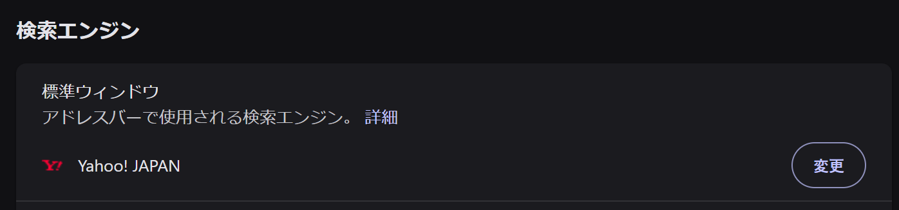
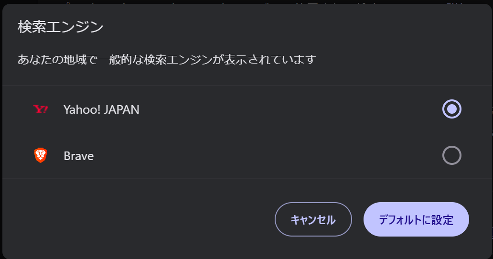

# Brave-Google-Search-redirector

Are you having trouble using Google Search on the Brave browser? Try installing this extension!

## Prerequisite
> **Important:** This extension will **not work** unless you set your default search engine to **Yahoo!**.

## Installation

### Method 1: Install via .crx
Drag and drop the `.crx` file into your extensions page (`brave://extensions/`).

### Method 2: Load Unpacked (If .crx installation fails)
If you cannot install the `.crx` file:
1. Open `brave://extensions/` and enable **Developer mode** (toggle in the top right corner).
2. Download or clone the source files from this repository.
3. Click **Load unpacked** and select the `brave-google-search-redirector` folder.

## Setup Guide

1. Open settings from the menu icon.
   

2. Navigate to the Search engine settings.
   

3. Check your search engine setting.
   

4. If not selected, choose Yahoo! Japan.
   

##　Additional Information
* ** Microsoft Edge Support:** It has been confirmed that this extension also works on **Microsoft Edge** to bypass default Bing searches. (Set the default search engine to Yahoo! Japan in Edge settings as well, and install via `edge://extensions/`.)

## Note
* This extension was created using AI.

---
Made by しろえあ